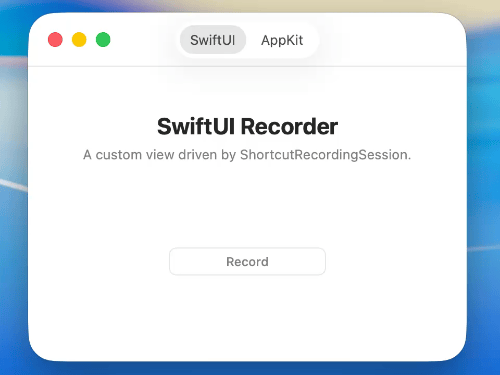

# ShortcutKit

*Global keyboard shortcuts for macOS, with your own UI.*

ShortcutKit records local keyboard input and registers global shortcuts. Build the recorder with SwiftUI, AppKit, or both. The package has no dependencies and needs no Accessibility or Input Monitoring permissions.



## What you get

- **Shortcut recording.** There is no built-in recording view. Build your own from recording state and events, or copy the polished SwiftUI and AppKit recorders from the example app.
- **Saved shortcuts.** Define shortcuts by name and store changes in `UserDefaults`.
- **In-memory shortcuts.** Register a `Shortcut` directly without saving it.
- **Key-down and key-up.** Handle a shortcut once, or react while it is held.
- **Keyboard layouts.** Use fixed US English labels or the current macOS input source.
- **More keyboard types.** ANSI, ISO, and JIS keys have correct typed values and labels.

## Requirements

macOS 14+ and Swift 5.10+.

## Installation

### Swift Package Manager

Add ShortcutKit to your `Package.swift` dependencies:

```swift
.package(url: "https://github.com/sieroshtan/ShortcutKit", from: "0.1.0")
```

## Quick start

Give a saved shortcut a name and an optional default value:

```swift
import ShortcutKit

extension Shortcuts.Name {
    static let togglePanel = Self(
        "togglePanel",
        default: Shortcut(key: .k, modifiers: [.command, .shift])
    )
}
```

Register it when your app starts. ShortcutKit keeps the registration active:

```swift
try Shortcuts.register(.togglePanel) {
    togglePanel()
}
```

The callback runs on key-down. Use `onEvent:` when key-up also matters:

```swift
try Shortcuts.register(.togglePanel, onEvent: { phase in
    switch phase {
    case .keyDown: beginAction()
    case .keyUp: endAction()
    }
})
```

A name has one callback. Registering the same name again replaces the old callback.

## Change a saved shortcut

Save a new value or restore the default:

```swift
try Shortcuts.set(newShortcut, for: .togglePanel)
try Shortcuts.reset(.togglePanel)
```

Read the current saved or default value for your UI:

```swift
let shortcut = Shortcuts.shortcut(for: .togglePanel)
```

`Shortcuts.set` updates an active registration automatically. If registration fails, the previous shortcut stays active. Call it only after any confirmation your UI needs.

`Shortcuts.RegistrationError` reports:

- `.unavailable` when the shortcut is already used.
- `.invalidShortcut` when the shortcut cannot be registered.
- `.system(status:)` for an unexpected macOS error.

## In-memory shortcuts

Register a fixed or temporary shortcut without reading or writing preferences:

```swift
let shortcut = Shortcut(key: .space, modifiers: [.command, .option])

try Shortcuts.register(shortcut) {
    showQuickLook()
}
```

It stays active until the app exits or you remove it:

```swift
Shortcuts.unregister(shortcut)
```

The same `onEvent:` overload provides key-down and key-up events.

## Record with your UI

`ShortcutRecordingSession` is observable and works with both SwiftUI and AppKit. It pauses ShortcutKit global shortcuts while recording, then registers them again when recording stops.

`RecordingState` contains the modifiers and keys currently held:

```swift
let recorder = ShortcutRecordingSession()

recorder.onChange = { state in
    updateCustomUI(
        modifiers: state.modifiers,
        pressedKeys: state.pressedKeys
    )
}
```

Use `onEvent` when your UI needs every key and modifier change:

```swift
recorder.onEvent = { event in
    switch event {
    case .keyDown(let key): handleKeyDown(key)
    case .keyUp(let key): handleKeyUp(key)
    case .modifierDown(let modifier): handleModifierDown(modifier)
    case .modifierUp(let modifier): handleModifierUp(modifier)
    }
}
```

Save a valid shortcut from `onCommit`. Keep recording if registration fails:

```swift
recorder.onRegistrationFailure = { _, error in
    showRegistrationError(error)
}

recorder.onCommit = { [weak recorder] shortcut in
    do {
        try Shortcuts.set(shortcut, for: .togglePanel)
        recorder?.stop()
    } catch {
        showRegistrationError(error)
    }
}

recorder.start()
```

## Format shortcuts

Fixed US English labels are used by default. Choose `.current` to use the active macOS input source:

```swift
let shortcut = Shortcut(key: .semicolon, modifiers: [.command])

ShortcutFormatter(layout: .english).string(for: shortcut) // "⌘;"
ShortcutFormatter(layout: .current).string(for: shortcut) // "⌘Ñ" with Spanish input
ShortcutFormatter().components(for: shortcut)             // ["⌘", ";"]

KeyFormatter().string(for: .deleteForward) // "Forward Delete"
KeyFormatter().string(for: .leftArrow)     // "←"
KeyFormatter().string(for: .f12)           // "F12"
```

Use `components(for:)` when your UI draws separate keycaps.

## Limits

- Recording works while the app is active.
- macOS or another app may consume a shortcut before local recording sees it. Finding these intercepted shortcuts would require Input Monitoring permission.
- Global shortcuts treat left and right modifier keys as the same modifier.

## Example app

Open `Example/ShortcutKitExample.xcodeproj` in Xcode and run the `ShortcutKitExample` scheme. It includes custom SwiftUI and AppKit recorders with live keycaps.

## License

[MIT](LICENSE)
